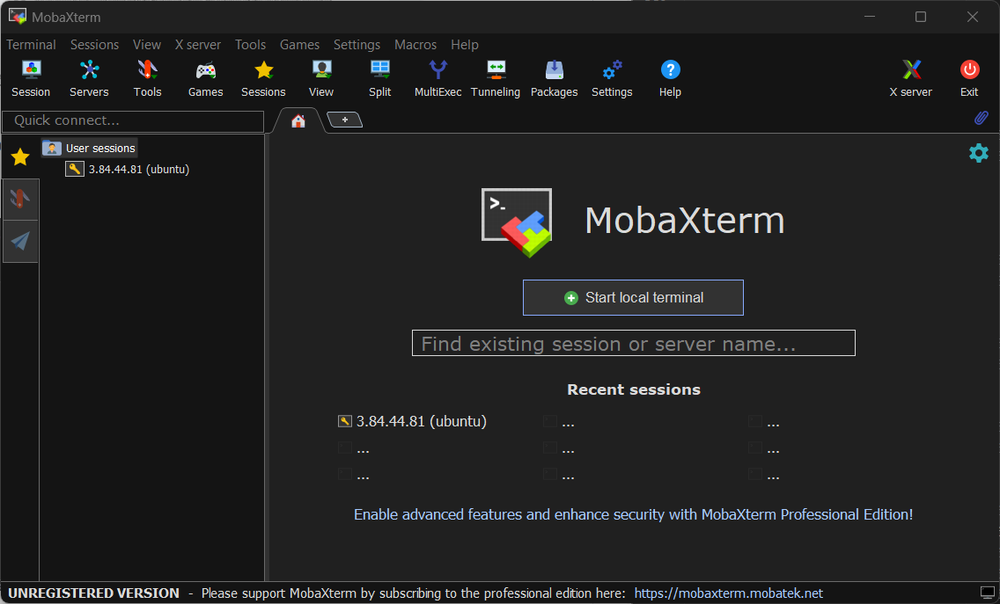

# Linux-Fundamentals

## Introduction

In the dynamic landscape of technology, mastering the fundamentals is essential for anyone aspiring to excel in fields such as DevOps, Cloud Computing, Software Development, Cybersecurity, Data Analysis/Science, AI, and QA Testing. This project is designed to equip you with a solid foundation in Linux. Understanding the tech from the basics lays the groundwork for success in various tech-centric careers.

## Project Overview

This project guides you through the process of creating, configuring, and managing an AWS EC2 instance running a Linux-based operating system (Ubuntu). The project covers launching an EC2 instance, connecting to it via SSH using MobaXterm, performing basic Linux operations, and setting up a web server using Nginx. Each step is documented with detailed explanations and linked screenshots for clarity.

## Project Objectives

- Learn how to create and manage an AWS EC2 instance.

- Understand SSH connectivity using a key pair and MobaXterm.

- Perform basic Linux commands for package management and system configuration.
Install, configure, and uninstall Nginx to host a simple web server.

- Demonstrate the ability to troubleshoot and verify configurations.

## Tools and Technologies

- AWS EC2: Cloud computing service for launching virtual servers.

- Ubuntu: Linux distribution used as the operating system for the EC2 instance.

- MobaXterm: Terminal emulator for SSH connections to the EC2 instance.

- Nginx: Lightweight web server for hosting a default webpage.

- UFW: Uncomplicated Firewall for managing firewall rules.

- Linux Commands: Tools like apt, tree, and systemctl for system management.

## Prerequisites

- An active AWS account with access to the AWS Management Console.

- MobaXterm (Home Edition) installed on your local machine.

- Basic understanding of Linux commands and SSH.

- A web browser to verify the Nginx webpage.

## Setting the Context

In this section, we will create a server in the cloud, and gain access to it from our local environment.
When we say "local environment", we are referring to your laptop or desktop PC, which in most cases runs Windows or MacOS.
Then, you will connect to that server in the cloud remotely, directly from your laptop.

## Step-by-Step Instructions

## 1. Create an AWS Account

Provide your email, password, and payment details to complete the setup.

## 2. Register for AWS

Fill out the required contact and billing info to activate your account.

## 3. Sign in to AWS

Use your credentials to access the AWS Management Console.

## 4. Access AWS Management Console

Explore services provided by AWS including EC2.

## 5. Navigate to EC2 Service

Search for and click the EC2 service.

## 6. View EC2 Instances

Check if any EC2 instances are currently running.

## 7. Launch a New EC2 Instance

Click “Launch Instance” to begin.

## 8. Name Server and Select OS

Name the instance (e.g., “Linux Server”) and choose Ubuntu 20.04 LTS.

## 9. Select Machine Image and Instance Type

Use t2.micro (Free Tier eligible).

## 10. Create or Select a Key Pair

Create or reuse a key for secure SSH.

## 11. ame Key, Choose Encryption, Download

ownload the .pem file and save securely.

## 12. Configure Network and Firewall Settings

Allow SSH (port 22) access.

## 13. Configure Storage

Set root volume size (e.g., 8 GB, SSD).

## 14. Launch Instance

Review and launch the instance.

## 15. View Connection Parameters

Get public IP and SSH command from dashboard.

## 16. Review Running Instance Summary

Check instance details to confirm instance is running.

# Connect to the Instance

**_Note:_** _We are using Mobaxterm for windows users and default terminal for Linux and MacOS users_

## 17. Visit MobaXterm Website (For Windows User Only)

Download MobaXterm for SSH access.

Click to download installer.

## 18. Launch MobaXterm and Start Terminal

Open a terminal session.

## 19. Navigate to Key Pair

Use chmod 400 key.pem.

## 20. Extract Instance Public IP

Copy from AWS EC2 dashboard.

## 21. Run SSH Command

ssh -i path/to/key.pem ubuntu@<public-ip>

# Perform Linux Operations

## 22. Check Hostname and Update

hostname 

## 23. Install Tree

sudo apt install tree

